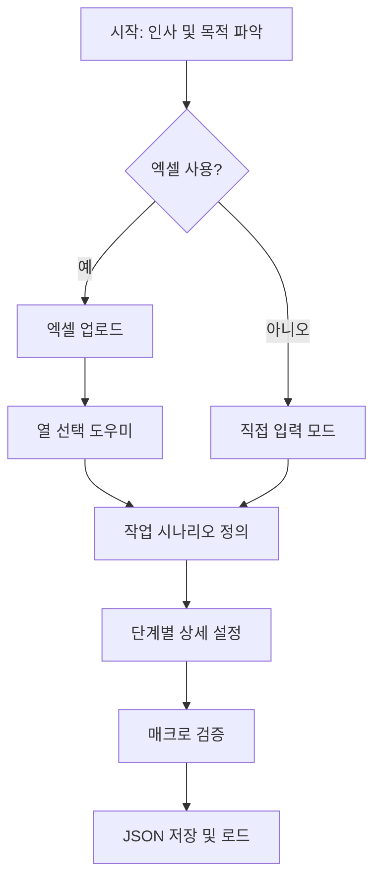

# Easy Macro 모드 설계 문서

## 1. 개요

Easy Macro는 기술적 지식이 없는 사용자도 대화형 인터페이스를 통해 쉽게 매크로를 만들 수 있는 기능입니다. 마치 친절한 도우미와 대화하듯 자연스럽게 매크로를 생성할 수 있습니다.

## 2. 핵심 컨셉

### 2.1 사용자 페르소나
- **기술 초보자**: 매크로가 무엇인지는 알지만 만들어본 적 없는 사용자
- **반복 작업자**: 엑셀 데이터를 웹사이트에 입력하는 등의 반복 작업을 하는 사용자
- **시간 절약 희망자**: 빠르게 자동화하고 싶지만 복잡한 설정은 원하지 않는 사용자

### 2.2 디자인 원칙
- **대화형**: 챗봇과 대화하듯 자연스러운 흐름
- **시각적**: 실시간으로 만들어지는 매크로를 시각화
- **단순함**: 최소한의 클릭과 입력으로 완성
- **안내형**: 각 단계마다 명확한 가이드 제공

## 3. UI/UX 설계

### 3.1 메인 레이아웃
```
┌─────────────────────────────────────────────────────────┐
│  Excel Macro Automation - Easy Macro Mode              │
├─────────────────────────────────────────────────────────┤
│ ┌─────────────────────────┬───────────────────────────┐ │
│ │   채팅 인터페이스          │   매크로 미리보기         │ │
│ │                         │                           │ │
│ │ 🤖 안녕하세요!           │   [시작]                  │ │
│ │    어떤 작업을 자동화     │     ↓                    │ │
│ │    하고 싶으신가요?       │   [엑셀 열기]             │ │
│ │                         │     ↓                    │ │
│ │ 👤 데이터 입력            │   [검색하기]              │ │
│ │                         │     ↓                    │ │
│ │ 🤖 좋아요! 엑셀 파일을    │   [입력하기]              │ │
│ │    사용하시나요?         │                           │ │
│ │                         │                           │ │
│ └─────────────────────────┴───────────────────────────┘ │
│ ┌─────────────────────────────────────────────────────┐ │
│ │  [📊 엑셀 사용]  [✏️ 직접 입력]  [❓ 도움말]        │ │
│ └─────────────────────────────────────────────────────┘ │
└─────────────────────────────────────────────────────────┘
```

### 3.2 대화 흐름 다이어그램


## 4. 대화 시나리오

### 4.1 시작 대화
```
🤖 안녕하세요! Excel Macro Helper입니다.
   어떤 작업을 자동화하고 싶으신가요?

   [📝 웹사이트에 데이터 입력]
   [🔍 웹사이트에서 정보 수집]
   [💾 파일 다운로드]
   [🎯 기타 작업]
```

### 4.2 엑셀 연동 대화
```
🤖 엑셀 파일의 데이터를 사용하시나요?

   [예, 엑셀 파일이 있어요]
   [아니요, 직접 입력할게요]

👤 예, 엑셀 파일이 있어요

🤖 좋아요! 엑셀 파일을 드래그하거나 클릭해서 업로드해주세요.
   
   [📁 파일 선택...]

🤖 파일을 확인했어요! 다음 열들을 찾았습니다:
   ✓ 이름
   ✓ 전화번호
   ✓ 주소
   
   어떤 정보를 사용하실 건가요? (여러 개 선택 가능)
```

### 4.3 작업 정의 대화
```
🤖 이제 어떤 순서로 작업하는지 알려주세요.
   일반적인 작업 순서를 추천해드릴게요:

   [➊ 로그인하기]
   [➋ 검색 페이지로 이동]
   [➌ 데이터 입력하기]
   [➍ 저장 버튼 클릭]
   [➎ 다음 데이터로 이동]

   또는 [✏️ 직접 설명하기]
```

## 5. 스마트 기능

### 5.1 자연어 이해 및 액션 변환
| 사용자 입력 | 변환된 액션 |
|----------|----------|
| "로그인하고 싶어요" | 텍스트 찾기(ID) → 클릭 → 입력 → 텍스트 찾기(PW) → 클릭 → 입력 → 버튼 클릭 |
| "검색창에 이름 입력" | 검색창 클릭 → 텍스트 입력 → 엔터키 |
| "결과 저장하기" | 저장 버튼 찾기 → 클릭 → 대기 |

### 5.2 템플릿 라이브러리
```
📚 인기 템플릿:
├── 🏢 업무 자동화
│   ├── 네이버 카페 글쓰기
│   ├── 구글 스프레드시트 입력
│   └── 이메일 자동 발송
├── 🛒 쇼핑몰 관리
│   ├── 상품 일괄 등록
│   ├── 재고 업데이트
│   └── 주문 처리
└── 📊 데이터 수집
    ├── 웹사이트 크롤링
    ├── 가격 정보 수집
    └── 뉴스 스크랩
```

## 6. 기술 아키텍처

### 6.1 컴포넌트 구조
```python
EasyMacroMode/
├── components/
│   ├── ChatInterface.py      # 채팅 UI
│   ├── MacroVisualizer.py    # 실시간 미리보기
│   └── ActionSelector.py     # 액션 선택 위젯
├── core/
│   ├── ConversationEngine.py # 대화 처리 엔진
│   ├── IntentParser.py       # 자연어 → 액션 변환
│   ├── MacroBuilder.py       # 매크로 생성기
│   └── TemplateManager.py    # 템플릿 관리
└── dialogs/
    ├── EasyMacroDialog.py    # 메인 다이얼로그
    └── QuickActionDialog.py  # 빠른 액션 선택
```

### 6.2 상태 관리
```python
class ConversationState(Enum):
    GREETING = "greeting"
    PURPOSE = "purpose"
    DATA_SOURCE = "data_source"
    EXCEL_MAPPING = "excel_mapping"
    ACTION_SEQUENCE = "action_sequence"
    ACTION_DETAIL = "action_detail"
    CONFIRMATION = "confirmation"
    COMPLETE = "complete"
```

### 6.3 데이터 플로우
```
사용자 입력
    ↓
ConversationEngine (상태 관리 및 응답 생성)
    ↓
IntentParser (의도 파악 및 액션 추천)
    ↓
MacroBuilder (MacroStep 객체 생성)
    ↓
JSON 변환 및 저장
    ↓
MacroEditor 자동 로드
```

## 7. 핵심 클래스 설계

### 7.1 ConversationEngine
```python
class ConversationEngine:
    def __init__(self):
        self.state = ConversationState.GREETING
        self.context = {}
        self.macro_steps = []
        
    def process_input(self, user_input: str) -> ConversationResponse:
        """사용자 입력 처리 및 응답 생성"""
        intent = self.intent_parser.parse(user_input)
        response = self.generate_response(intent)
        self.update_state(intent)
        return response
        
    def generate_response(self, intent: Intent) -> ConversationResponse:
        """현재 상태와 의도에 따른 응답 생성"""
        templates = self.template_manager.get_templates(self.state)
        return ConversationResponse(
            message=templates.get_message(intent),
            options=templates.get_options(intent),
            action=templates.get_action(intent)
        )
```

### 7.2 MacroBuilder
```python
class MacroBuilder:
    def __init__(self):
        self.steps = []
        self.excel_mapping = {}
        
    def add_action_from_intent(self, intent: str, params: dict):
        """자연어 의도를 MacroStep으로 변환"""
        if intent == "login":
            self.add_login_sequence(params)
        elif intent == "search":
            self.add_search_sequence(params)
        elif intent == "input_data":
            self.add_input_sequence(params)
            
    def add_login_sequence(self, params: dict):
        """로그인 시퀀스 자동 생성"""
        self.steps.extend([
            TextSearchStep(search_text="아이디", click_on_found=True),
            KeyboardTypeStep(text=params.get("username", "${아이디}")),
            TextSearchStep(search_text="비밀번호", click_on_found=True),
            KeyboardTypeStep(text=params.get("password", "${비밀번호}")),
            TextSearchStep(search_text="로그인", click_on_found=True)
        ])
```

## 8. 사용자 경험 최적화

### 8.1 실시간 피드백
- 각 단계 완료 시 체크 표시 ✓
- 잘못된 입력 시 즉시 수정 가이드
- 진행률 표시 (예: 3/5 단계 완료)

### 8.2 되돌리기 기능
- 모든 단계에서 이전으로 돌아가기 가능
- 대화 히스토리 유지
- "처음부터 다시" 옵션 제공

### 8.3 도움말 시스템
```
❓ 도움이 필요하신가요?

• 동영상 가이드 보기
• 자주 묻는 질문
• 1:1 문의하기
• 커뮤니티 도움 받기
```

## 9. 구현 로드맵

### Phase 1: 기본 대화 시스템
- [ ] ChatInterface UI 구현
- [ ] ConversationEngine 핵심 로직
- [ ] 기본 템플릿 3개 구현

### Phase 2: 스마트 기능
- [ ] IntentParser 구현
- [ ] 자연어 → 액션 변환
- [ ] 실시간 미리보기

### Phase 3: 고급 기능
- [ ] 템플릿 라이브러리 확장
- [ ] 사용자 정의 템플릿
- [ ] 학습 기반 추천

## 10. 예상 효과

### 10.1 사용성 향상
- 매크로 생성 시간 80% 단축
- 기술 장벽 제거
- 직관적인 사용자 경험

### 10.2 확장 가능성
- AI 기반 자연어 이해 추가 가능
- 음성 인식 인터페이스 연동 가능
- 모바일 앱으로 확장 가능