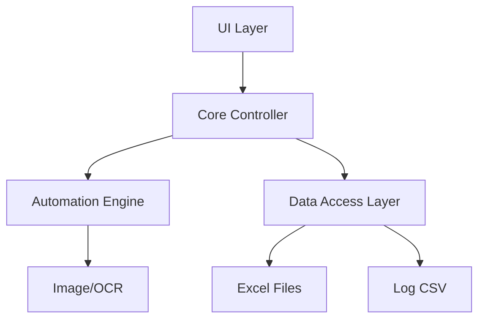

# Technical Requirements Document (TRD)

## 1. Executive Technical Summary
- **프로젝트 개요**  
  Python 기반 데스크탑 애플리케이션으로, 엑셀 파일의 작업 목록을 GUI로 로드·편집하고 PyAutoGUI/OpenCV/Tesseract를 이용해 마우스·키보드·화면 인식 매크로를 실행합니다. MVC 패턴을 적용해 유지 보수성과 확장성을 확보하며, 오프라인 환경에서 단일 파일 배포 방식(PyInstaller)으로 동작합니다.

- **핵심 기술 스택**  
Python 3.8+, PyQt5(Tkinter 대체), PyAutoGUI, OpenCV 4.x, EasyOCR, pandas, openpyxl, PyInstaller

- **주요 기술 목표**  
  • 1단계 실행 응답 ≤300ms  
  • 10,000행 처리 시 메모리 누수 없이 완료  
  • CPU 사용률 500단계/행 처리 시 50% 이하 유지  
  • 자동화 실패율 ≤5%  

- **중요 가정 사항**  
  • Windows 10/11 64bit 전용  
  • 인터넷 연결 없이 오프라인 실행  
  • 단일 사용자 환경(로컬 파일 저장)  
  • DPI 스케일 & 멀티 모니터 환경 자동 인식  

---

## 2. Tech Stack

| Category         | Technology / Library   | Reasoning (선택 이유)                                    |
| ---------------- | ---------------------- | ------------------------------------------------------- |
| 언어             | Python 3.8+            | 풍부한 라이브러리와 커뮤니티, 빠른 개발 속도              |
| GUI 프레임워크   | PyQt5                  | 직관적 WYSIWYG 에디터, 풍부한 위젯, 반응형 레이아웃 지원  |
| GUI 대체         | Tkinter                | PyQt5 비설치 시 기본 제공, 최소 기능 보장                |
| 자동화 엔진      | PyAutoGUI              | 마우스/키보드 제어, 크로스 플랫폼 지원                   |
| 이미지 처리      | OpenCV 4.x             | 고성능 이미지 서치 및 DPI 스케일 보정                     |
| OCR 엔진         | EasyOCR                | 한글 인식 정확도가 높고, Tesseract 대비 실패율이 낮음. 파이썬 연동도 매우 간편함. |
| 엑셀 처리        | pandas, openpyxl       | 대용량 엑셀 데이터 처리, 시트·셀 CRUD 지원               |
| 패키징           | PyInstaller (onefile)  | 단일 실행 파일 배포, 오프라인 설치 지원                 |
| 구조 패턴        | MVC                    | 역할 분리로 유지보수성·확장성 확보                        |
| 설정·정의 저장   | JSON                   | 가볍고 가독성 높은 매크로 단계 정의 파일                  |

---

## 3. System Architecture Design

### Top-Level Building Blocks
- UI Layer (PyQt5/Tkinter)  
  • 작업 편집기, 시트·열 매핑, 실시간 미리보기  
- Core Controller  
  • 사용자 인터랙션 처리, 매크로 단계 조합, 상태 관리  
- Automation Engine  
  • PyAutoGUI 기반 동작 실행, OpenCV 이미지 서치, EasyOCR 엔진 OCR  
- Data Access Layer  
  • pandas/openpyxl로 엑셀 입출력, 로그(CSV) 저장  
- Config & Plugin Manager  
  • JSON 기반 플러그인/단계 정의 로딩, 다국어 리소스  
- Packaging & Deployment  
  • PyInstaller 빌드 스크립트, AES-256 암호화 옵션  

### Top-Level Component Interaction Diagram


- UI Layer에서 Core Controller로 사용자 입력·명령 전달  
- Core Controller가 Automation Engine과 Data Access Layer를 조정  
- Automation Engine은 OpenCV·Tesseract로 화면 인식 후 PyAutoGUI로 동작 실행  
- Data Access Layer는 엑셀 파일 입출력 및 실행 로그(CSV) 저장  

### Code Organization & Convention

**Domain-Driven Organization Strategy**  
- Domain Separation: `excel`, `ui`, `automation`, `core`, `plugin`  
- Layer-Based Architecture: `presentation(UI)`, `application(core)`, `domain(automation)`, `infrastructure(data)`  
- Feature-Based Modules: 단계별(`mouse_actions`, `keyboard_actions`, `image_search`, `flow_control`)  
- Shared Components: 공통 유틸(`utils`), 암호화·설정(`config`), 로깅(`logger`)

**Universal File & Folder Structure**
```
/project-root
├── build/                     # PyInstaller 빌드 출력
├── config/
│   ├── settings.json         # 앱 설정(암호화)
│   └── locales/              # 다국어 리소스
├── plugin/                    # 확장 플러그인 정의(JSON)
├── src/
│   ├── core/                  # 애플리케이션 로직
│   ├── ui/                    # PyQt5/Tkinter 뷰
│   ├── automation/            # PyAutoGUI, OpenCV, OCR 모듈
│   ├── data/                  # 엑셀 및 로그 입출력
│   ├── utils/                 # 공통 유틸리티
│   └── main.py                # 엔트리 포인트
├── tests/                     # 단위/통합 테스트
└── requirements.txt           # 패키지 의존성
```

### Data Flow & Communication Patterns
- **클라이언트-컨트롤러 통신**: UI 이벤트 → Core Controller 메서드 호출  
- **데이터베이스(엑셀) 상호작용**: pandas/openpyxl 동기식 읽기·쓰기  
- **외부 서비스 연동**: 없음(오프라인 환경 기본)  
- **실시간 통신**: UI 스레드와 백그라운드 작업 스레드 간 큐/시그널  
- **데이터 동기화**: 실행 로그(CSV)에 단계별 결과 즉시 기록  

---

## 4. Performance & Optimization Strategy
- 이미지 매칭용 ROI(Region of Interest) 및 템플릿 캐싱으로 검색 속도 개선  
- 백그라운드 스레드 사용으로 UI 응답성 확보  
- OpenCV 멀티스레드 빌드 활용 및 Tesseract ROI 설정으로 OCR 속도 최적화  
- 메모리 누수 방지 위해 실행 후 리소스(이미지·객체) 명시적 해제  

---

## 5. Implementation Roadmap & Milestones

### Phase 1: Foundation (MVP Implementation)
- **Core Infrastructure**: 개발 환경 설정, CI/CD(GitHub Actions), 기본 프로젝트 구조  
- **Essential Features**: 엑셀 불러오기·매핑 UI, 마우스·키보드 순차 실행, 상태 열 업데이트  
- **Basic Security**: 설정 파일 AES-256 암호화 저장  
- **Development Setup**: 가상환경, lint(Flake8), 단위 테스트 프레임워크  
- **Timeline**: 3개월

### Phase 2: Feature Enhancement
- **Advanced Features**: 이미지 서치(OpenCV), OCR(pytesseract), Loop·If 제어  
- **Performance Optimization**: 스레드 최적화, 템플릿 캐싱 개선  
- **Enhanced Security**: 코드 서명, 설치 패키지 보안 옵션  
- **Monitoring Implementation**: 상세 실행 로그 CSV 뷰어 모듈  
- **Timeline**: 2개월

### Phase 3: Scaling & Optimization
- **Scalability Implementation**: 플러그인 아키텍처 완성, 멀티 모니터 안정화  
- **Advanced Integrations**: 자동 업데이트 체크, 다국어 UI, 다크모드  
- **Enterprise Features**: 로컬 템플릿 갤러리, 구성 동기화 옵션  
- **Compliance & Auditing**: 감사 로그, 실행 이력 리포트  
- **Timeline**: 2개월

---

## 6. Risk Assessment & Mitigation Strategies

### Technical Risk Analysis
- **기술 리스크**: 이미지 매칭 오류 → DPI 보정 알고리즘 및 멀티 모니터 좌표 동기화  
- **성능 리스크**: 대용량 데이터 처리 시 느려짐 → ROI 캐싱·백그라운드 스레드 활용  
- **보안 리스크**: 설정 파일 무단 열람 → AES-256 암호화 및 파일 권한 제한  
- **통합 리스크**: Tesseract 버전 호환성 → 사전 테스트 및 로컬 번들링  
- **Mitigation**: 사전 환경 검증 스크립트, 자동화 테스트, 주기적 보안 감사

### Project Delivery Risks
- **일정 리스크**: 기능 복잡도 과소평가 → MVP 범위 명확화 및 주기적 스코프 리뷰  
- **리소스 리스크**: Python GUI 전문 개발자 부족 → 문서화·내부 워크숍 실시  
- **품질 리스크**: 테스트 커버리지 저조 → CI 병합 전 80% 이상 커버리지 강제  
- **배포 리스크**: 병원 보안 정책 차단 → 오프라인 설치 패키지, 디지털 서명 제공  
- **비상 계획**: 주요 기능 지연 시 Nice-to-Have 후순위 조정, 페일오버 설치 지침 작성  

